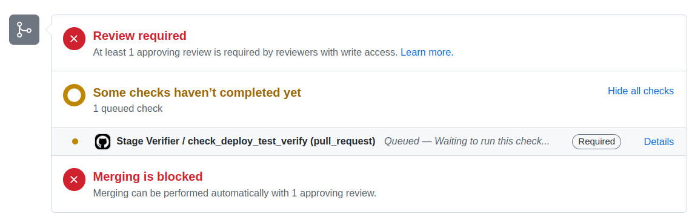
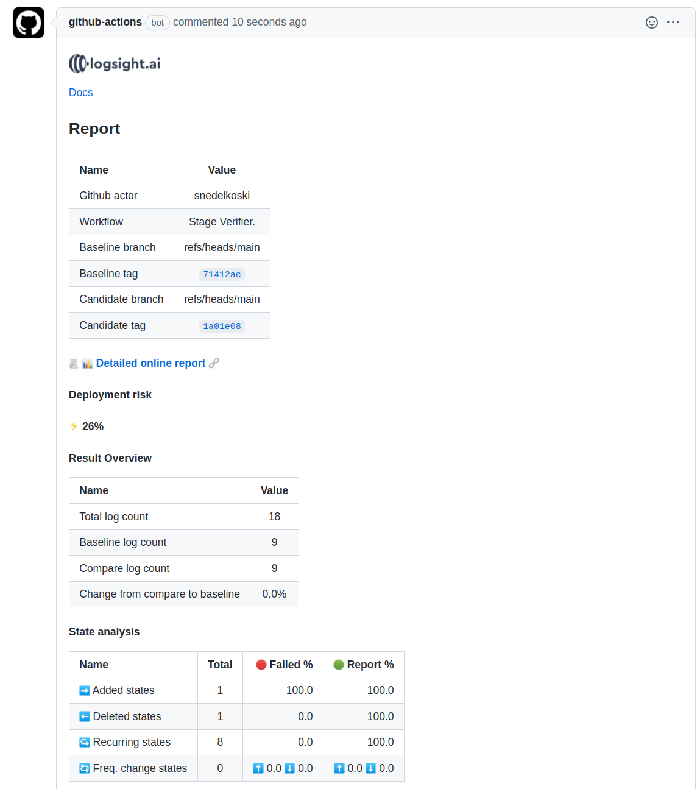
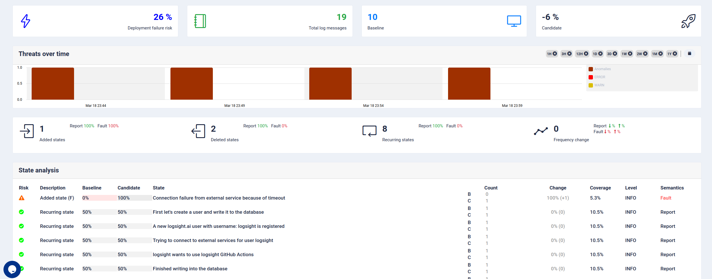

# Hello logsight.ai from GitHub Actions

### Steps
1. **Fork** the repository 
2. Go to **Pull Requests** and click on **New pull request**
3. Set `compare` to `base` and **Create pull request**. The quality check will run.
4. You can try the same with opening another Pull Request, now by setting `compare` to `candidate` and **Create Pull Request**. The quality check will run.

5. After few minutes, if the check is not passing, it will create an issue report that specifies the **deployment risk**. You can check the report in the **Issues**.

### Output

The issue will look like as similar to:

#### Detailed report
To open the detailed online report, you need to have [logsight.ai](https://demo.logsight.ai/) user account. **Login and then click** on the detailed report.

The detailed online report shows the overview and the state analysis as in:

The hello-logsight example ends here. You can get more in-depth knowledge about the actions and how to use them at the [Docs.](https://docs.logsight.ai/#/monitor_deployments/github_action)

