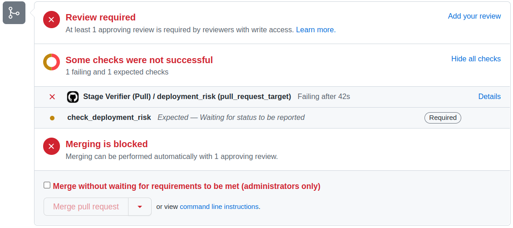

# Hello logsight.ai from GitHub Actions

### Steps
1. [Open tutorial in extra browser page](https://docs.logsight.ai/#/monitor_deployments/github_action)
2. **Fork** the repository 
3. Go to **Pull Requests** and click on **New pull request**
4. Set `compare` to `candidate` and **Create pull request**.

 

5. The **quality check will run**.

 

6. If the check is failing, it will create an issue report that specifies the **deployment risk**. You can check the report in the [**Issues**](https://github.com/aiops/hello-logsight/issues).

### Output

The issue looks similar to:

 

#### Detailed report
To open the detailed online report, you need to have [logsight.ai](https://demo.logsight.ai/) user account. **Login and then click** on the detailed report.

The detailed online report shows the overview and the state analysis as in:

 

The hello-logsight example ends here. You can get more in-depth knowledge about the actions and how to use them at the [Docs.](https://docs.logsight.ai/#/monitor_deployments/github_action)

