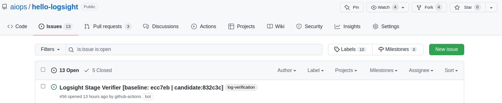
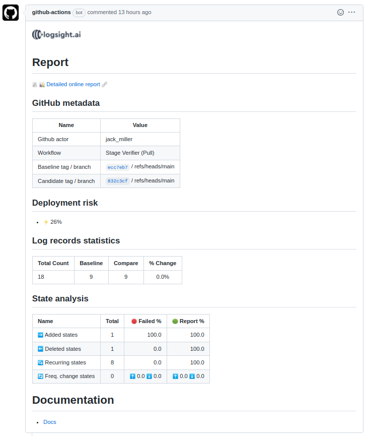

# :wave: Hello logsight.ai from GitHub Actions

**Continuous Verification and Testing** are important phases of software delivery.
This repo described how [logsight.ai](https://logsight.ai) can be used to add Quality Gates to a CI/CD pipeline build with [GitHub Actions](https://docs.github.com/en/actions).
 
We use the [Stage Verifier](https://docs.logsight.ai/#/stage_verification/overview) service from [logsight.ai](https://logsight.ai) since it enables to analyze and compare log files generated by differente versions of an application.

## Use Case

+ You are collaborating on changes to a repository using your own branch
+ You create a pull request to propose a new feature
+ Before merging the changes, the CI/CD triggers a continuous verification gate 

+ [Logsight](https://logsight.ai) [Stage Verifier](https://docs.logsight.ai/#/stage_verification/overview) analyzes the logs generated by the two applications / branches
+ The deployment risk score is :warning: 78% 
+ Since the risk is high, the merge is automatically cancelled and a [GitHub Issue](https://docs.github.com/en/issues) is created

## For the impatient

To try the simplicity and transparency of using [Logsight](https://logsight.ai), we recommend you to follow the instructions directly from our [Hello Logsight tutorial](https://docs.logsight.ai/#/integration/github_action)

1. **Fork** the [hello-logsight](https://github.com/aiops/hello-logsight) repository 

 

2. Go to **Pull Requests** and create a **New pull request**

 

3. In the **compare** drop-down list, set `compare: candidate`

 

4. **Create pull request**

 

5. The **continuous verification** gate runs

 

6. If the verification fails:bangbang:, a report is created with the **deployment risk** at [**Issues**](https://github.com/aiops/hello-logsight/issues).

 

6. If the verification fails:bangbang:, a report is created with the **deployment risk**.
The report is available under GitHub [**Issues**](https://github.com/aiops/hello-logsight/issues).

 

## Github Report

The following image gives an example of a report created by the CI/CD [Stage Verifier](https://docs.logsight.ai/#/stage_verification/overview) gate:

 

## Logsight.ai Report

You can also view a **more detailed** report of the verification using the online service.
You need to have a [logsight.ai](https://demo.logsight.ai/) user account. 

To access the report, select the **Detailed onine report** link shown in the Github Report.

 

# :wave: Goodbye

The hello-logsight example ends here.
You can get more in-depth knowledge about the actions and how to use them at [docs.logsight.ai](https://docs.logsight.ai/#/integration/github_action)

